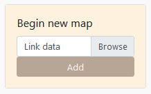
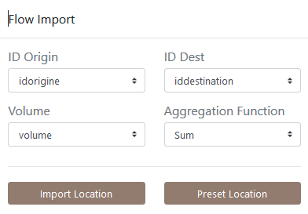

# Data import

## RICardo data 

For this tutorial, we will use the historical trade flows listed in the [RICardo database](https://github.com/gflowiz/sageo-ricardo). The files used are available in this repository and have the following structure :

- [SAGEO_RICardo_nodes.csv](https://raw.githubusercontent.com/gflowiz/sageo-ricardo/master/SAGEO_RICardo_nodes.csv) : geographical location of entities files
	- id (identifier of the geographical entity)
	- name (name of the geographical entity)
	- type (entity type : _country_, _city_, ...)
	- continent (_continent_)
	- lat (_latitude_)
	- long (_longitude_)

- [SAGEO_RICardo_edges_small.csv](https://raw.githubusercontent.com/gflowiz/sageo-ricardo/master/SAGEO_RICardo_edges_small.csv) : aggregated historical trade flows (to reduce the size of the dataset)
	- idorigin (identifier of the entity of origin of the flow)
	- iddestination (identifier of the destination entity of the flow)
	- volume (financial volume of the flow in pounds sterling)
	- decennie (decade concerned by the flow)

- [SAGEO_RICardo_edges_nona.csv](https://raw.githubusercontent.com/gflowiz/sageo-ricardo/master/SAGEO_RICardo_edges_nona.csv) : non-aggregated historical trade flows
	- idorigin (identifier of the entity of origin of the flow)
	- iddestination (identifier of the destination entity of the flow)
	- volume (financial volume of the flow in pounds sterling)
	- annee (year of the exchange)
	- periode (period of the exchange)
	- decennie (decade of exchange)

***Arabesque*** also allows you to import your own flow data
sets, in the form of an origin-destination matrix (adjacency
list format in CSV), explore and filter them to create a
readable flow map, in accordance with the principles of
cartographic semiology.

## Links (*edges*) data

Arabesque requires the loading of at least one stream data set: a link file in CSV (separator: comma) and long format. 

You must also declare the 3 minimum fields required for flow mapping: those corresponding to the origin locations, the destination locations and the flow values. 

If the OD matrix is temporal or available for different categories, you must also choose an aggregation method.

On the homepage of([Arabesque](http://arabesque.ifsttar.fr/)), load at least one set of flow data.

* Click on the browse button

**Application**

Loading data *SAGEO_RICardo_edges_small.csv*.

## Nodes (*vertex*) data

## Preset data

## Agreggations on weighted links

## Automated computations

### For the nodes

### For the links

### For weighted links
