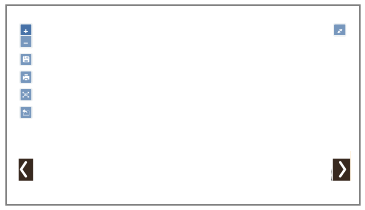
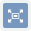
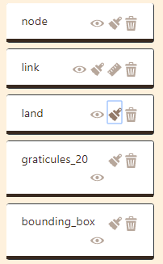
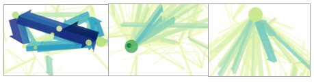
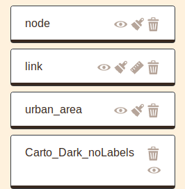

# Interface

The different steps of the creation/exploration/geovisualization of a flowmap are accessible through the interface of Arabesque.

>1. Importing flow datasets (links and/or nodes)
>2. Processing flow datasets (indicators calculation, ...)
>3. **Geographical data computing : designing the map background (layers, ...)**
>4. **Cartographic symbolization : designing the flowmap signs (arrows, ...)**
>5. **Statistical data computing (filtering, ...)**
>7. **Export**

**The general structure of the interface** is composed of three panels.

- The **central panel** is for displaying the map - centered in France here.

The two side panels are for playing with information:

- The **left panel** is for dealing with geometries and geographical layers. Here are displayed CARTO Based map : Voyager and 

- The **right panel** is for playing with the flow data set.

## The central panel

The central part of Arabesque corresponds to the **map view**. It results from the choice of the layers to be displayed (from the left panel) and the filtering of the values of the links and nodes (from the right panel).

This central panel also presents different buttons allowing the implementation of primary actions.

### Primary actions with butons

The white page of Arabesque is decorated with blue action buttons.

**Details of the different buttons**

 Successively zoom in/out - the same way as with the mouse wheel.

 Save the project in .ZIP for later use.

 Export the map in .PNG including legends and and contributors' sources for external backgrounds such as OSM or NaturalEarth data.

 Refocus and display the entire view without zooming in/out or panning.

 Export the filtered flow data - the ones visible on the map - as a list file in .JSON format.

 Show/hide the legend.

 Switch to full screen display - with black background.

 Open/close the panels located on each side of the map.

### Primary legend

A legend is automatically generated for each map for nodes and links plot.

The symbolization elements (size, color and opacity) of the nodes and links are included. Here (for the default map), it is the volume of flows and the degree of places that are represented.

## The geographic panel

The left panel is to **design the map**:

- dealing with the background as the geographical/geometrical layers 

- customize the _design_/style of the nodes and links features
map.

The management of geographic information is composed of two sub-sections:

 Return to the [home page](arabesque.ifsttar.fr) to start a new view.

Actions on the background of the map are for changing projections of the current map and/or to add other layers : remote or personal one. 

See [Design map background](./Design-map-background.html) section.

Actions on the design/style is for (additional) geographic layers that have been adding through the previous action. 

See [Design flowmap signs](./Design-flowmap-signs.html) section.

## The geographic layer manager

In practice, a map is composed by several layer such as the bounding boxes, the graticules, the countries of land, etc.

### Layers forming a flowmap

All these layers (from RIcardo example) can be loaded in the map design background section by Add Layers. 

They then appear in the layer manager sub-panel, one above the other as shown below.

The present layers are all available on the map - but not necessarily all of them are visible.

The layers on the view are positioned in an order that affects their visibility. The top layer will be visible in the foreground.

### Layer rearrangement

The drawing of the different layers and their objects can be finely parameterized in _Arabesque_, in order to take into account the possible complexity of the information (density of the matrix) which requires a particular management of the superimpositions and the arrangements of the layers of links and nodes.

In the example below, the largest links are placed in the foregroundby default, while the largest circles are not. After their rearrangement, the largest links are background and their color intensity has been changed (See Chapter [Designing flowmap signs](./Design-flowmap-signs.html)).

_EXAMPLE:_ rearrangement of nodes and links.

The position of the layers above and below (foreground/lowerground) can be modified by a simple drag and drop.

_**Do it yoursel!**_: 

-- Click on the link layer and hold it down;

-- Drag/drop the link layer and place it in the foreground;

-- Release the layer;

-- Repeat the same operation with the node layer if necessary._

After that, it can be seen that the flow layer has just been brought to the forefront.

## The statistical panel

The **right panel** is for playing with the flow data set, nodes and links, and to **filter the map**.

 Display a filtering on the links/flows

 Display a filtering on the nodes

