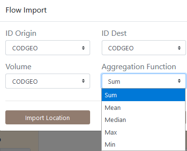
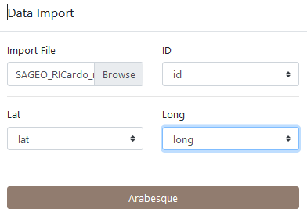
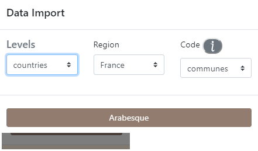
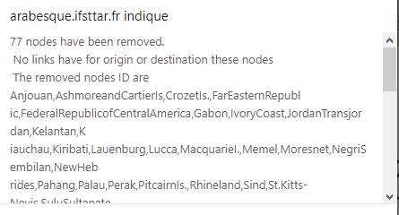

# Data import

Arabesque also allows you to import your own data sets : (1) flowdata in the form of an origin-destination matrix (adjacency long format in .csv), to agregate them if necessary and (2) nodes dataset before building a readable flowmap.

For this tutorial, we will use for example the historical trade flows listed in the [RICardo database](https://github.com/gflowiz/sageo-ricardo). 

For more informations about the dataset and its use with Arabesque, see in [References](./examples.html).

The application _Arabesque_ accepts as input files in the following format: .CSV, .JSON and .geoJSON.

## Links/flow dataset importation

_Arabesque_ requires the loading of at least one origin-destination links/edges/flow data set. It is a matrix in .CSV (separator: comma) and long format. 

### Origin, Destination and unique flow matrice

You must also declare the 3 minimum fields required for flow mapping: those corresponding to the origin locations, to the destination locations and the flow values. 

If the OD matrix is temporal or available for different categories, you must also choose an aggregation method.

On the homepage of [Arabesque](http://arabesque.ifsttar.fr/) load at least one set of flow data.

* Click on the browse button

**Application**

Statistical dataset

Loading data *SAGEO_RICardo_edges_small.csv*.

The data must be in long format, with at least 3 columns  : origin, destination, flow

_NOTE_ : Remember that data must be in long format, with at least 3 columns to identify the origin, destination and volume of flows.

### Origin, Destination and multiscalar matrice

If the flow data are multiscalar (e.g. flows that concern several social groups, several goods transported or that occur on several dates), agregations procedures are suggested when importing the dataset in _Arabesque_.

By default, the sum function is applied in the lack of any specifications. However, the user can choose to apply an average, minimum, maximum or median function calculated on all the matrices or graphs provided. 

It is also possible to choose a single date or to aggregate the data, according to a given function, over a period or for categories. 

This aggregation unction is important because it defines the default flowmap which will be proposed at the entry of _Arabesque_: the percent of links, nodes and interaction depicted, the intensity of the colors and the opacity of the corresponding signs (see [Data processing](./data-processing.html) chapter.

Note: This aggregation does not interfere with the geo-visualization possibilities that will remain available for all existing types.

## Nodes/vertex dataset importation

If you have locational data associated with your ODs, you can load the corresponding node files with "Import Location",
otherwise you can use predefined locations with "Preset Location".

If you select "Import Location", you must load a .GEOJSON or .CSV file, then choose the ID of the nodes and their lat/long geographic coordinates.

_EXAMPLE:_ Application on RIcardo dataset.

Loading _SAGEO_RICardo_nodes.csv_ data

The data must be in long format, with at least 3 columns to identify the place and the latitude (Y) and longitude (X) coordinates.

If you do not have a file for the geometry, you can use the codes identifying the reference data (e.g. INSEE codes of the French communes, ISO codes of the countries), to automatically geolocate your nodes. See Preset.

## Preset nodes dataset

Example of pre-selection of French municipalities.

After loading the link and node files, Arabesque automatically performs a join of the common attributes between the two files.

## Checking missing nodes/links features

Links that do not have an origin and/or destination ID are automatically deleted. Nodes that don't have an ID code that allows them to be geographically located are also not kept.

The list of deleted nodes and links is displayed in a new window.

This list is for quick reference only. You must copy and paste it (into a text file, for example) if you want to keep the list of deleted entities : here 77 nodes have been deleted because they are not related to other nodes. The corresponding nodes ID are list.

After loading the link and node files, _Arabesque_ automatically performs a join of the common attributes between the two files and computes indicator on botk links and nodes data.

## Import a flowmap project

Import a previously made flowmap by loading a project file in .zip format.

