# Interface

The general structure of the interface of Arabesque is composed of three panel. 
- The *central* panel is for displaying the map and the two side panels is for playing with information.
- The *left* panel is for dealing with geometries and geographical layers
- The *right* panel is for playing with the flow data set.

Loading data into Arabesque leads to the creation of a default map, which is placed in the center of the interface.

## General Presentation

### Default flow mapping

Only the 10% most important links (in value) are represented and symbolized (see the automatic legend) according to their intensity (the flow variable entered at import).
The corresponding nodes are symbolized according to their degree (variable calculated automatically during the import).

Hereby is the Ricardo's dataset default map with global statistic of the percent of links versus the percent of volume of flows and nodes.

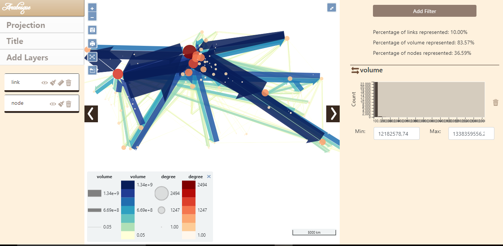

By default, the links are represented in shades of blue and the nodes in red. The map is presented in the WGS84 projection, according to the lat/lon coordinates* declared during the import.

Except in the case of loading a projected geometry as input, the map is presented in WGS84.

## The central panel

The central part of Arabesque corresponds to the map view. It results from the choice of the layers to be displayed (from the left panel) and the filtering of the values of the links and nodes (from the right panel).

This central panel also presents different buttons allowing the implementation of primary actions.

### Primary actions with butons

 Return to the [home page](arabesque.ifsttar.fr) to start a new view.

 Successively zoom in/out - the same way as with the mouse wheel.

 Save the project in .ZIP for later use.

 Export the map in .PNG including legends and and contributors' sources for external backgrounds such as OSM or NaturalEarth data.

 Refocus and display the entire view without zooming in/out or panning.

 Export the filtered flow data - the ones visible on the map - as a list file in .JSON format.

 Show/hide the legend.

 Switch to full screen display - with black background.

 Open/close the panels located on each side of the map.

### Primary legend

A legend is automatically generated for each map for nodes and links plot.

The symbolization elements (size, color and opacity) of the nodes and links are included. Here (for the default map), it is the volume of flows and the degree of places that are represented.

## The geographic panel

The left panel is for dealing with the geography/geometry layers and customize the map.

The management of geographic information is composed of two sub-sections:

Actions on the background of the map are for changing projections of the current map and/or to add other layers.

Actions on the design/style is for (additional) geographic layers that have been adding through the previous action.

*Add Other layers*

Five types of geographic layers can be loaded/add to construct the map (Add Node Feature and Add Link Features) and/or to contextualize the map (Add Base Layer, Add Tile Layers (OSM), Import GeoJson Layers).

Add Node Feature and Add Link Features leads to act on the design/style the flow features: to symbolize and customize the links and the nodes.

### Add Node Features

Add Node Feature leads to act on the design/style of the flow places features.

It is possible to set up all the graphic dimensions of the nodes.

*Color*: The color of the nodes can be fixed (e.g. in red) or shaded in a range of tones.

The reference for the color schemes is Cynthia Brewer palette for Diverging, Multi Hue and Single Hue. See: [Color Brewer advices for maps](https://colorbrewer2.org/#type=sequential&scheme=BuGn&n=3). An Extra Palette is also proposed in Arabesque.

The color of the node can be set according to one of the variables (initial or calculated by Arabesque) present in the dataset.

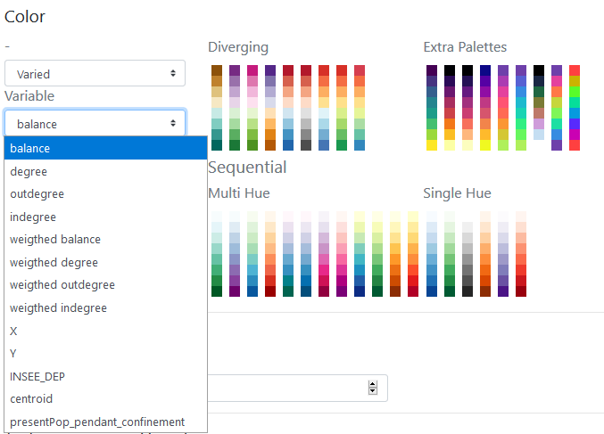

By definition, the type of color range (Diverging/Multi Hue/Single Hue/Extra Palette) will have to be realized according to the type of the variable to represent (quantitative/qualitative, discrete/continuous, stock/ratio/scale, ...). 

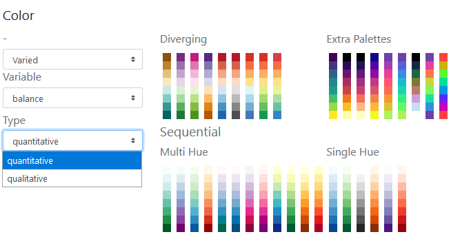
The progression (up/down) of the *colorrange* depends on that of the *value range*: it can be direct or inverse. The checked box means an inverse progression: a light color is applied to a strong value.

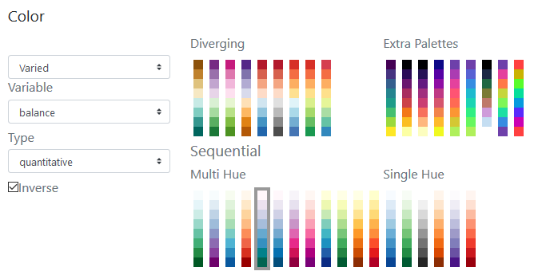

*Size*: The size of the nodes can be fixed and the weight defined.

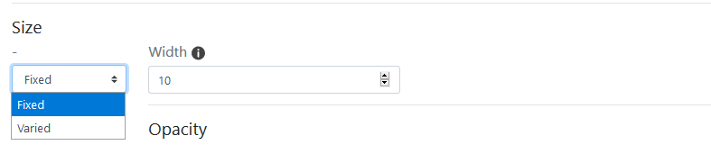

The size can be *weighted by a variable* according to one of the initial or additional *variables* available in the dataset (hereby the balance).

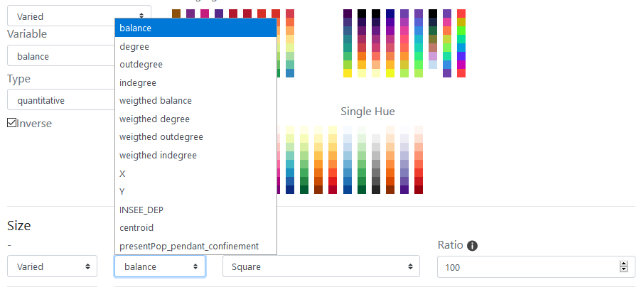
Three functions to set the size of the node according to the corresponding value are proposed: the square, the square root and the logarithm.

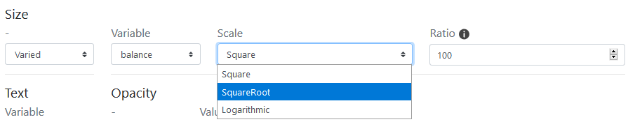

The *ratio* representing the max width in pixel of the graphic features can be defined - according to the map bounding box, to obtain an image with balanced features (neither too small nor too big).

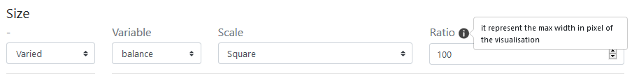

*Text*: textual element can also be added near the nodes.

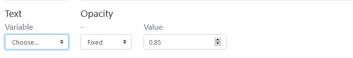
The text can be defined according to one of the variable available in the dataset.

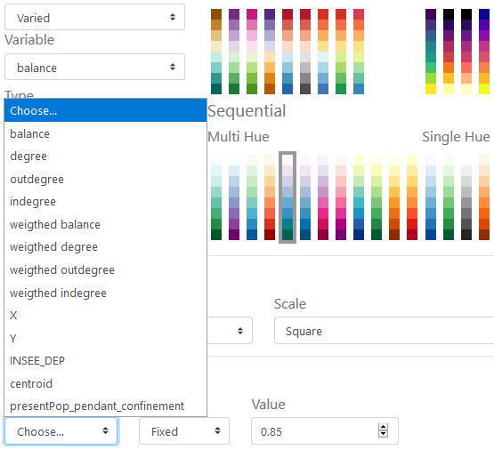.

The opacity of the text shade (currently set to black) can be set to a given value (here 0.85).

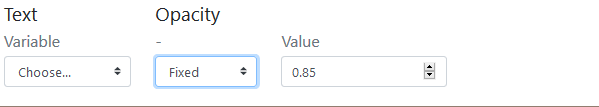

The opacity of the text shade (currently set to black) can be varied according to an indicator present in the dataset.

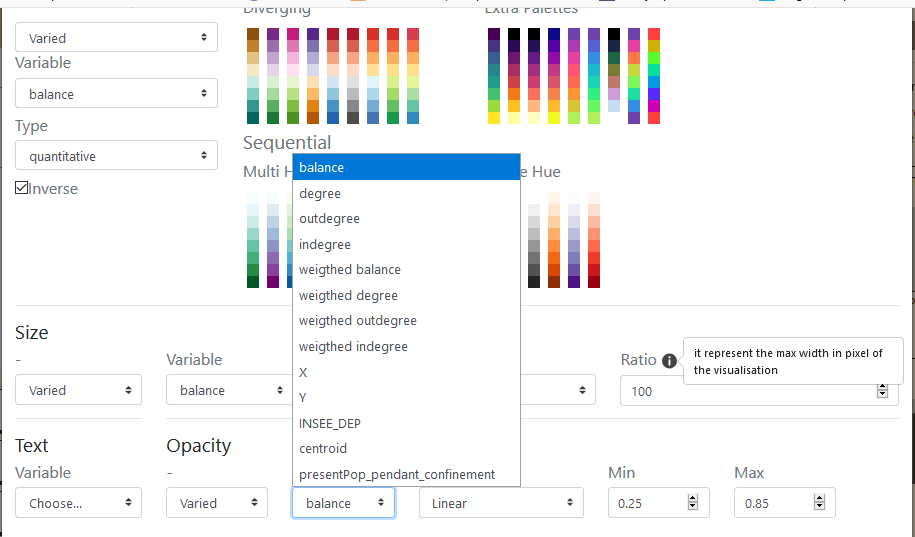

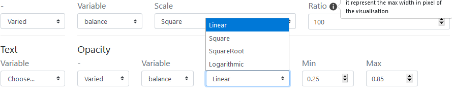

The opacity of the text shade can vary according to an indicator present in the dataset and according to a corresponding function which can be Linear, Square, SquareRoot or Logarithm and defined in an min/max interval: here between 0.25 and 0.85. 

### Add Link Features

Add Link Feature leads to act on the design/style the flow interactions features.

### Add  Base Layer

### Add Tile Layers (OSM) 

### Import GeoJson Layers

*General*
    - Projections
    - Title
    - Management and symbolization of layers (Add Layers)

Manipulation, layout and display of layers
    - Links
    - Nodes
    - Other layers
## Map

## The statistical panel
