# Design and style of the map background

This section is about loadind external and personal layers as background, and their customization.

The management of the map background is related to the geographic information. It is composed of 3 sub-sections: projection, Title and Add layers.

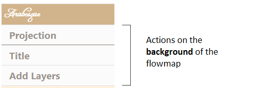

### The Add Projection

Geographic layers can be reprojected, by choosing one of the proposed formulas: 

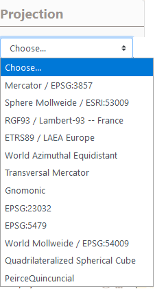

Reprojection can also be used by entering an EPSG code.

EXAMPLE: several projections of RICardo data

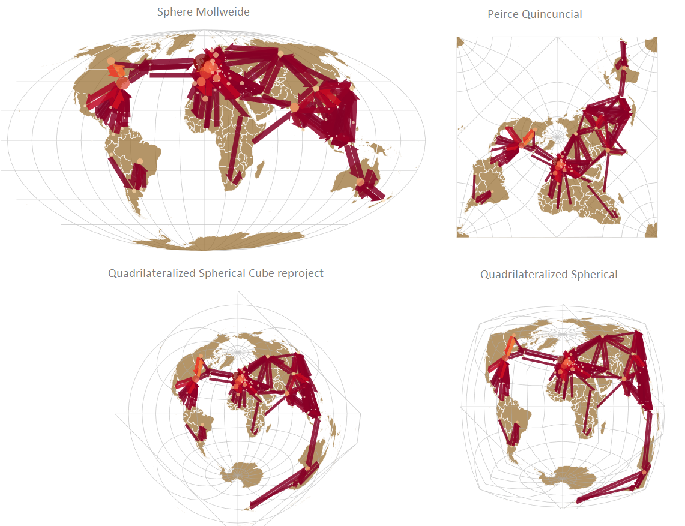

### The Add Title

The Add Title section allows you to add a simple title to the view, useful when importing

### The Add layers

Five types of geographic layers can be loaded/add to construct the map (Add Node Feature and Add Link Features) and/or to contextualize the map (Add Base Layer, Add Tile Layers (OSM), Import GeoJson Layers).

Add Node Feature and Add Link Features leads to act on the design/style the flow features: to symbolize and customize the links and the nodes.

#### Add Node Features

Add Node Feature leads to act on the design/style of the flow places features.

It is possible to set up all the graphic dimensions of the nodes by "Choose semio" for cartographic semiology as Bertin (1967). Hereby the general window.

**Color** 
The color of the nodes can be fixed (e.g. in black) or shaded in a range of tones.

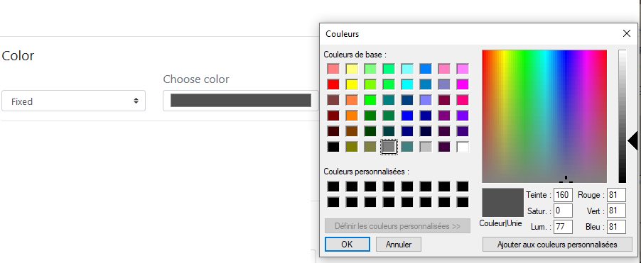

**_Example_** : Application on the nodes. Symbolization of the barycenter of the zones with a circle shape (unique choice for instance) of fixed size and unique black color.

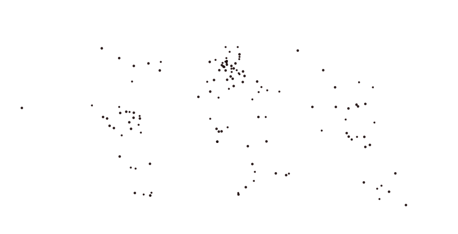

The color of the nodes can be shaded in a range of tones.

The reference for the color schemes is Cynthia Brewer palette for Diverging, Multi Hue and Single Hue. See: [Color Brewer advices for maps](https://colorbrewer2.org/#type=sequential&scheme=BuGn&n=3). An Extra Palette is also proposed in Arabesque.

The color of the node can be set according to one of the variables (initial or calculated by Arabesque) present in the dataset.

By definition, the type of color range (Diverging/Multi Hue/Single Hue/Extra Palette) will have to be realized according to the type of the variable to represent (quantitative/qualitative, discrete/continuous, stock/ratio/scale, ...). 

The progression (up/down) of the **color range** depends on that of the **value range**: it can be direct or inverse. The checked box means an inverse progression: a light color is applied to a strong value.

#### **Size**
The size of the nodes can be fixed and the weight defined.

The size can be **weighted by a variable** according to one of the initial or additional **variables** available in the dataset (hereby the balance).

Three functions to set the size of the node according to the corresponding value are proposed: the square, the square root and the logarithm.

The **ratio** representing the max width in pixel of the graphic features can be defined - according to the map bounding box, to obtain an image with balanced features (neither too small nor too big).

**Text**
Textuals elements can also be added near the nodes.

The text can be defined according to one of the variable available in the dataset.

The opacity of the text shade (currently set to black) can be set to a given value (here 0.85).

The opacity of the text shade (currently set to black) can be varied according to an indicator present in the dataset.

EXAMPLE : Application of the shade opacity on the nodes. Symbolization of the nodes with a circle shape of variable size according to a linear function, represented with a shaded black shade with opacity variation.

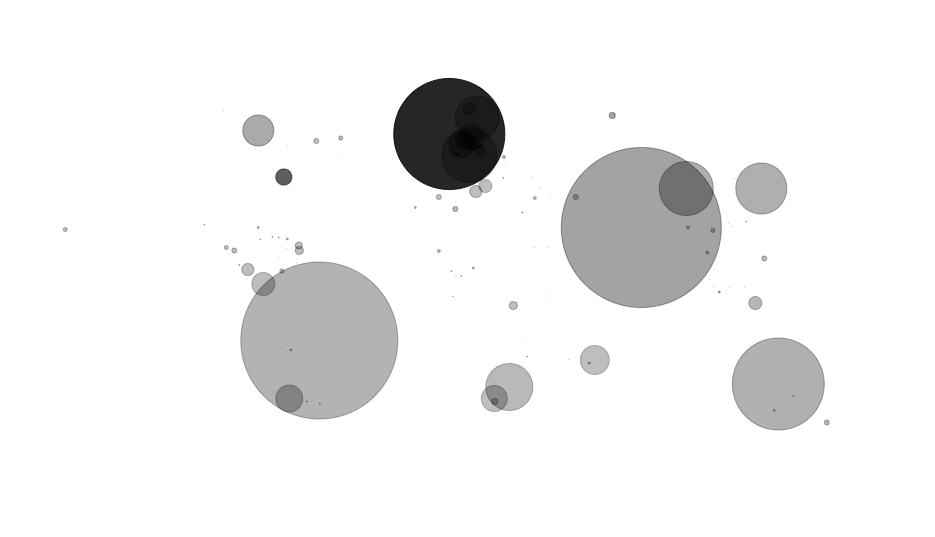

The opacity of the text shade can vary according to an indicator present in the dataset and according to a corresponding function which can be Linear, Square, SquareRoot or Logarithm and defined in an min/max interval: here between 0.25 and 0.85. 

#### Add Link Features

Add Link Feature leads to act on the design/style the flow interactions features.

It is possible to "Choose semio" for _cartographic semiology_ as Bertin (1967). Hereby the general window.

The symbology of the links consists of setting their design parameters and applying visual variables to qualitatively enrich the map.

The colors of the links and nodes need to be defined, for reasons of visual harmony.

EXAMPLE: straight bilateral oriented links, unique black color.

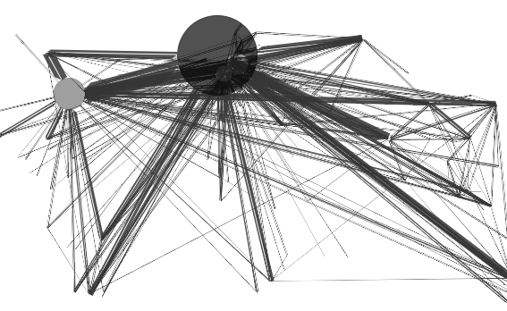

##### Geometry

The geometry of the link can be oriented or not.

Oriented geometry takes into account the direction of the **flow** to define the **graphic form** of the sign.

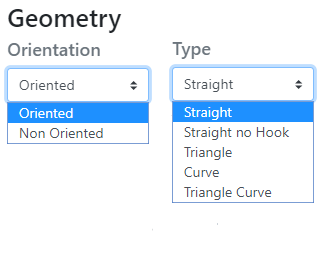

Five form are available : straight (as euclidian distance symbolisation), straight no hook, Triangle, (line) Curve and Triangle curve.

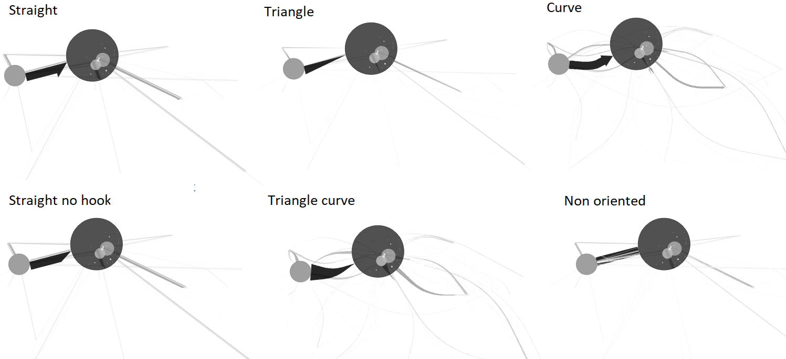

- **Straight**:  The link is straight and oriented, with a half arrowhead

- **Straight no hook**: The link is straight and oriented, it has a point without hook

- **Triangle**: The link is straight and takes the shape of a triangle

- **Curve** : The link is curved and oriented, its curvature is configurable.

- **Triangle curve**: The link is curved and takes the shape of a drop of water, its curvature is configurable.

- **Non oriented**: The link is straight, validated or not, it has no orientation.

**The design of arrows**

The arrow geometry - which corresponds to the visual shape variable - can be rectilinear or curvilinear. 

The curvature of the line is generated according to the Chaikin algorithm which allows to parameterize its height and its base, with respect to the body of the link.

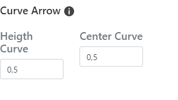

- **Arrow / Height curve**: The value of the height of the head is the percentage of the map distance of the link (distance between the origin and the destination) used to define the maximum (map) width of the link - the width being itself a function of the value of the flow.

- **Arrow / Height**: The value of ([0,1]) is that of the center of the curve; the point is identified by the indication of a distance from the origin node of the link.

EXAMPLE*: various geometry of a same Covid-19 flowmaps.

##### Semiology

**Color**

The Color of the links can be fixed ie it is identical for all links.

The reference for the color schemes is Cynthia Brewer palette for Diverging, Multi Hue and Single Hue. See: [Color Brewer advices for maps](https://colorbrewer2.org/#type=sequential&scheme=BuGn&n=3). An Extra Palette is also proposed in Arabesque.

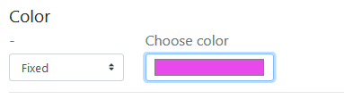

The color of the links can also be set according to one of the variables present in the dataset. It is based on a predefined tone gradient. The choice of the progression (divergent or not) will depend on the type of character (specified in the type field).

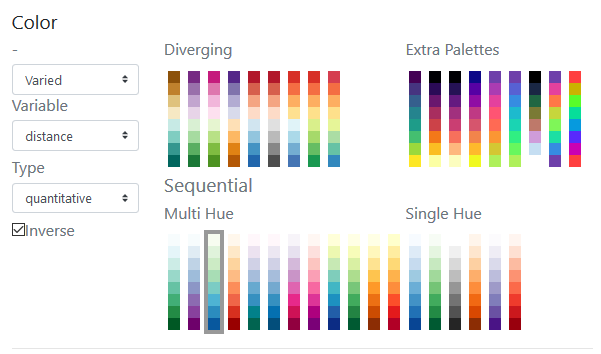

The choice to shade the links is associated here with a continuous (pseudo) character whose type (quantitative) must be specified.

**Size**:

Ideally, it is necessary to simultaneously set the size of the links. Ideally, it is necessary to simultaneously set the size using a discrete character. The links's color using a continuous character (ratio or rate) - otherwise, the links will keep the same size and the result of the application of a nuance will be hardly visible.

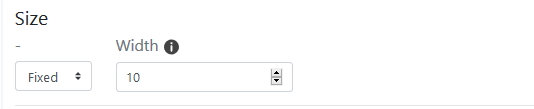

**Scale**:

Four functions to set the size of the links according to the corresponding quantitative and discrete value are proposed: the linear, the square, the square root and the logarithm.

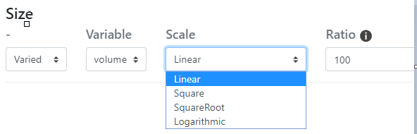

**Ratio**: it represents the max width in pixel of the graphic features that can be defined - according to the map bounding box, to obtain an image with balanced features (neither too small nor too big) regarding the scale function.

**Opacity**

The opacity of the link's color can vary according to an indicator and also to a corresponding function which can be Linear, Square, SquareRoot or Logarithm and defined in an min/max interval: here between 0.25 and 0.85.

EXAMPLES: 

(1) Black and white nodes under links as triangle curve with varied opacity. 

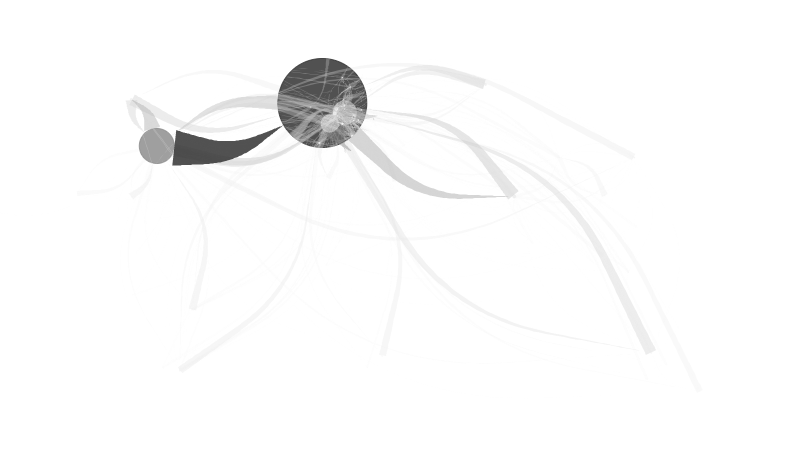

(2) Black and white nodes on links as triangle curve with varied opacity. 

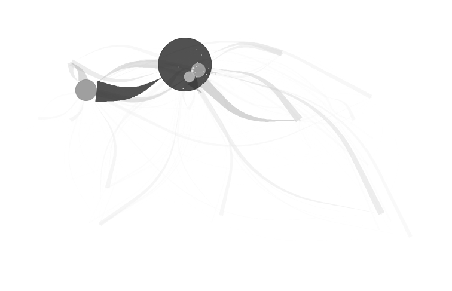

See layout management section to manage the overlay of the layers.

#### Add Base Layer

Add based layers consists in calling a remote geographic information layer, to contextualize the flowmap.

Several layers are available :

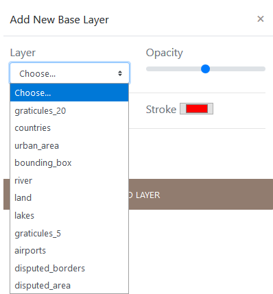

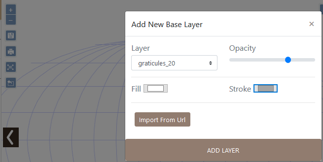

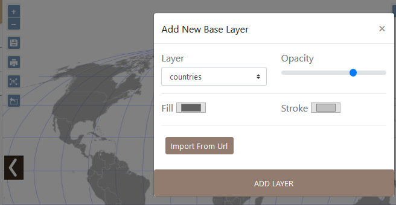

EXAMPLE: various geometry of a same Covid-19 flowmaps.

#### Add Tile Layers (OSM) 

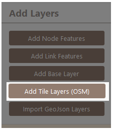

The Base type of tiles layers come from Open Street Map (OSM). 
See for details: [OSM tile server](https://wiki.openstreetmap.org/wiki/Tile_servers)

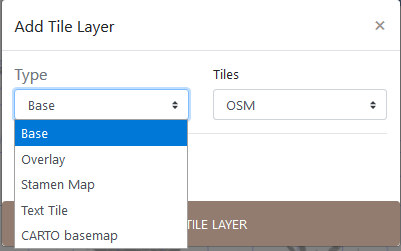
Several OSM tiles are available.

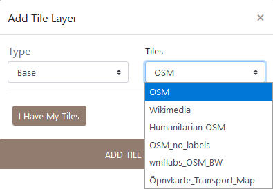

The second type of tile layer is the Overlay one, specially adapted for maps related to transportation, by sea (OPenSeaMap), by bike (Waymarkedtrails Cycling) or by hiking (Waymarkedtrails Hiking). 

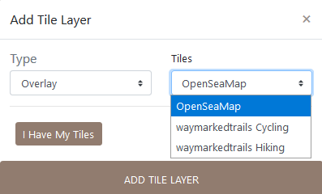

The third type of tile layer is the famous Stamen one.

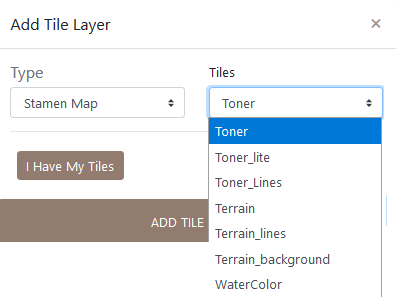

For **Stamen styles**, see [Stamen Open source tools](https://stamen.com/open-source/).

Text layer can be loaded, and present a style compatible to Stamen, CARTO and voyager nolabels.

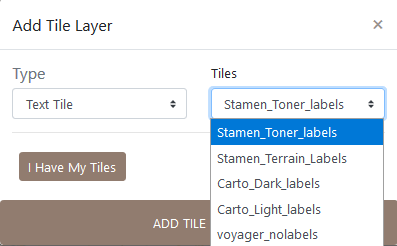

The four type of tile layers is CARTO basemap,which is available in six types of layers.

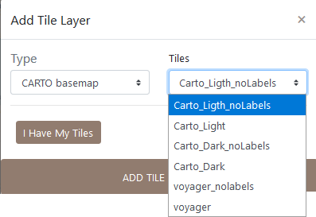

The CARTO base map styles details are available  [here](https://carto.com/help/building-maps/basemap-list/)

EXAMPLE: Different layers to geographically contextualize a flow dataset.

You can also add an **external/personal tile**.

You can **import additional tiles** by specifying a URL, the sources/contributors and setting the rendering.

#### Import GeoJson Layers

**Import Geojson** is to load a personal vector layer.

