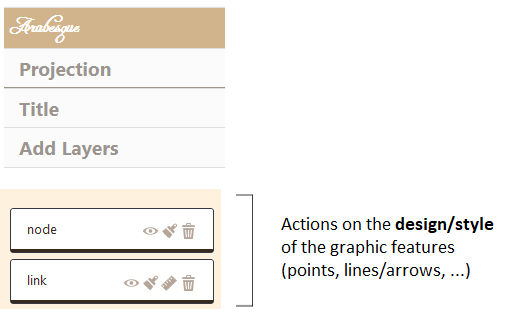
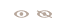
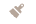

# Design of the flowmap signs (nodes/links)

This section is about changing the semiology (design/style) and changing the geometry (size, ...) of flowmap signs: nodes and links.

Several types of actions can be performed on all the layer level available in the layer management section, using the following icon-buttons.

## Types of action on a layer

Visible/invisible the layer.

 
Semiology parameters for nodes and links: color, size, text, opacity.

 

Geometry parameters for changing links/arrows shape only (not available for nodes): orientation, type of link (curve, triange, ...) and arrow head parameters.

 

Definitively deletes the layer.

## Designing the nodes

Drawing the nodes opens a window that allows you to act on their parameters related to semiology, respecting the Jacques Bertin' (1967) principes. 

### Semiology paramaters

Hereby the general window.

#### The color of nodes

The color of the nodes can be fixed (e.g. in black) or shaded in a range of tones.

The color of the nodes can be shaded in a range of tones.

The reference for the color schemes is Cynthia Brewer palette for Diverging, Multi Hue and Single Hue. See: [Color Brewer advices for maps](https://colorbrewer2.org/#type=sequential&scheme=BuGn&n=3). An Extra Palette is also proposed in Arabesque.

The color of the node can be set according to one of the variables (initial or calculated by Arabesque) present in the dataset.

By definition, the type of color range (Diverging/Multi Hue/Single Hue/Extra Palette) will have to be realized according to the type of the variable to represent (quantitative/qualitative, discrete/continuous, stock/ratio/scale, ...). 

The progression (up/down) of the **color range** depends on that of the **value range**: it can be direct or inverse. The checked box means an inverse progression: a light color is applied to a strong value.

#### **Size**
The size of the nodes can be fixed and the weight defined.

The size can be **weighted by a variable** according to one of the initial or additional **variables** available in the dataset (hereby the balance).

Three functions to set the size of the node according to the corresponding value are proposed: the square, the square root and the logarithm.

The **ratio** representing the max width in pixel of the graphic features can be defined - according to the map bounding box, to obtain an image with balanced features (neither too small nor too big).

#### **Text**
Textuals elements can also be added near the nodes.

The text can be defined according to one of the variable available in the dataset.

The opacity of the text shade (currently set to black) can be set to a given value (here 0.85).

The opacity of the text shade (currently set to black) can be varied according to an indicator present in the dataset.

## The nodes' geometric parameters

Not implemented yet.Upcoming projects.

## Designing the links

### Semiology parameters

### Change arrow shape 

Drawing the links opens a window that allows you to act on several dimensions of their geometry.

