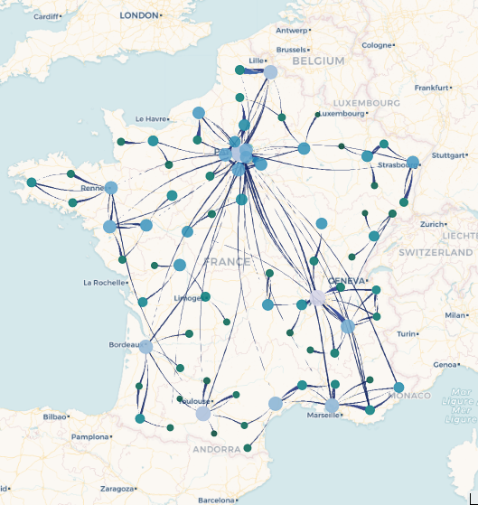

# Data sets and examples {#examples}

*Arabesque* provides several origin-destination flow data sets that are used either to illustrate the documentation or to serve as application cases for the DEMO section (these are accessible from the home page)

## RIcardo Data set used in the documentation

### RIcardo general description

RIcardo historical trade flows are used in the documentation and in the DEMO. 

The files come from [RIcardo](http://ricardo.medialab.sciences-po.fr/#/), a research project on historical international trade flows,observed from the beginning of the Industrial Revolution to the World War II. The project combines a historical trade flows database covering all countries of the world, see: [github/medialab/ricardo_data](https://github.com/medialab/ricardo_data/releases/tag/2017.12) with a website that offers to explore the history of international trade flows through visualizations, see: [medialab/ricardo](http://ricardo.medialab.sciences-po.fr/#/). 

In order to produce the first cartographic/geovisualizations of this historical corpus describing trade flows, some dataset has been prepared by Paul Girard (Medialab, Sciences Po) and Béatrice Dedinger (Centre d'Histoire, Sciences Po) for collective handling and exploitation during the GEOWEB-gflowiz worshop organized during the SAGEO2019 conference
(More information: [geoweb-gflowiz-Sageo](https://geoflowiz.hypotheses.org/workshop-geoweb-gflowiz-sageo2019).

### RIcardo nodes/links files description

RIcardo's files have the following structure:

- [SAGEO_RICardo_nodes.csv](https://raw.githubusercontent.com/gflowiz/sageo-ricardo/master/SAGEO_RICardo_nodes.csv): geographical location of entities files
	- id (identifier of the geographical entity)
	- name (name of the geographical entity)
	- type (entity type : _country_, _city_, ...)
	- continent (_continent_)
	- lat (_latitude_)
	- long (_longitude_)

- [SAGEO_RICardo_edges_small.csv](https://raw.githubusercontent.com/gflowiz/sageo-ricardo/master/SAGEO_RICardo_edges_small.csv) : aggregated historical trade flows (to reduce the size of the dataset)
	- idorigin (identifier of the entity of origin of the flow)
	- iddestination (identifier of the destination entity of the flow)
	- volume (financial volume of the flow in pounds sterling)
	- decennie (decade concerned by the flow)

- [SAGEO_RICardo_edges_nona.csv](https://raw.githubusercontent.com/gflowiz/sageo-ricardo/master/SAGEO_RICardo_edges_nona.csv) : non-aggregated historical trade flows
	- idorigin (identifier of the entity of origin of the flow)
	- iddestination (identifier of the destination entity of the flow)
	- volume (financial volume of the flow in pounds sterling)
	- annee (year of the exchange)
	- periode (period of the exchange)
	- decennie (decade of exchange)

## Datasets used for demonstration purposes

These data sets are available on the Arabesque home page, in the **DEMO** section: [arabesque/DEMO]!(http://arabesque.ifsttar.fr/) 

### Swiss Commuting

Data: Daily commutes in Switzerland (2014),
Source: [Swiss Federal Statistical Office](https://www.bfs.admin.ch/bfs/de/home/statistiken/mobilitaet-verkehr/personenverkehr/pendlermobilitaet.html)

### London Bike Sharing

Data: Number of trips between stations of the London's Santander Cycle Hire Scheme in 2017.
Source:[Data London](https://data.london.gov.uk/)

### French Commuting/Mobilités professionelles (MOBPRO)

Data: [INSEE/MOBPRO](https://www.insee.fr/fr/statistiques/fichier/4509353/base-csv-flux-mobilite-domicile-lieu-travail-2017.zip)
Source: INSEE, 2018 
Documentation : [MOBPRO/Doc](https://www.insee.fr/fr/statistiques/4509353#dictionnaire)
déplacements domicile - lieu de travail Recensement de la population - Base flux de mobilité.

### French School Mobilities/Mobilités scolaires (MOBSCO)

Data: [INSEE/MOBSCO](https://www.insee.fr/fr/statistiques/fichier/4509360/base-csv-flux-mobilite-domicile-lieu-etude-2017.zip)
Source: INSEE, 2018
Documentation [MOBSCO/Doc](https://www.insee.fr/fr/statistiques/4509360#dictionnaire)
déplacements domicile - lieu de travail
Recensement de la population - Base flux de mobilité)

